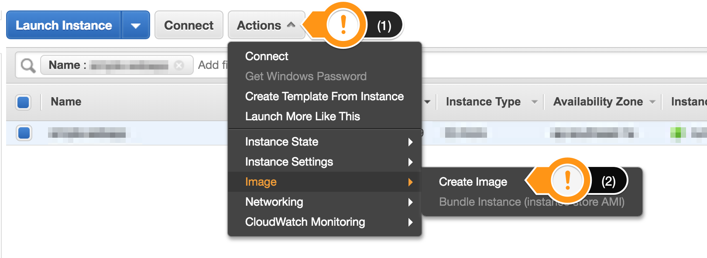
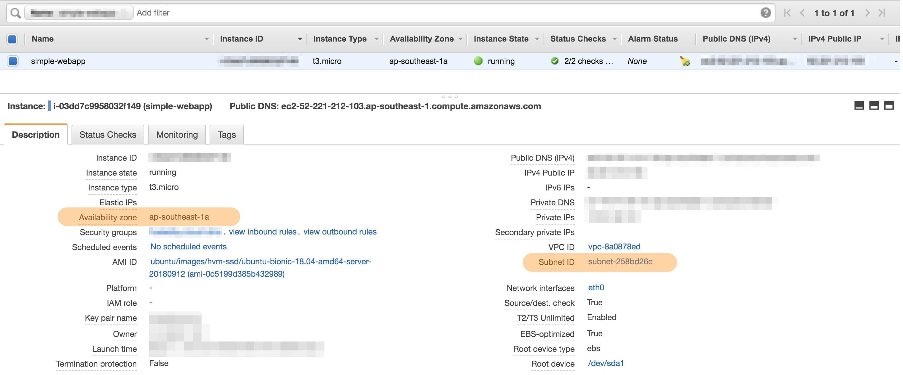

Module 2: Augment your web application with load balancing
===

In this module, we'll talk about how you can use load balancing to scale out applications
across multiple instances. Being able to scale your workloads out is essential in 
running applications that can rapidly adapt to changing real-time demand.


## Solution Architecture

We'll be building off the previous module's architecture.
The web application will function in exactly the same way, except that after this module,
we'll be using multiple instances to run multiple web servers.

A load balancer will be deployed to receive HTTP requests.
It will also be responsible for delegating the requests across all the web servers behind it.


You can extend the same architecture by adding more instances if you'd like.
**By deploying across multiple availability zones**, you can take advantage of the 
[AWS global infrastructure](https://aws.amazon.com/about-aws/global-infrastructure/),
and introduce more durability and resilience to your applications.

## Implementation Overview

Make sure you're using the same application as from the previous module.

### 1. Create an AMI of your web server

Once you've created an EC2 instance and set it up according to your liking, you can
**create an image of it for future use** (called an AMI). This way, when we need to create a copy
of your instance, you won't need to go through all the steps you went through the first time.

#### High-level instructions

Create an AMI of the web server you created in Module 01.

<details>
  <summary><strong>Step-by-step instructions (click to expand):</strong></summary>
  <p>
1. In your EC2 dashboard, make sure the instance you created is selected.

2. Select **Actions > Image > Create Image** from the top menu.

   

3. Give your AMI a unique name you'll easily remember (and optionally a description), and set the same **10GB** of storage as before, then click **Create Image**.

4. The AMI creation process will take a while. You can verify this by going to **AMIs** on the left-hand navigation
   of your EC2 dashboard, and waiting until the status turns to `available`.
  </p>
</details>


### 2. Create a second EC2 instance using your image

If you remember when you created your first EC2 image, you actually had to select an AMI for your first step.
AWS maintains a curated set of barebones AMIs for you to use, but you can also use your own.

In this step, we'll use the AMI you just created to start a copy of your web server.

#### High-level instructions

Create another EC2 instance using your new AMI.
Make sure that the EC2 instance is in a different **public** subnet as your first one.

<details>
  <summary><strong>Step-by-step instructions (click to expand):</strong></summary>
  <p>
    
1. Follow the steps [in Step 1 of Module 01](../tree/module-01#1-create-an-ec2-instance), but do the following:

    1. In `Step 1`: Select **My AMIs** on the left, and select the AMI you just created.
    2. In `Step 3`: Use the same **Network**, but select a different **Subnet** than your first instance. 
      The subnet of your first instance is visible in the Description tab when you select it on the dashboard.
      
      
      
    3. Also in `Step 3`: at the very bottom in **Advanced Settings**, add in the following startup script:
    ```
    #!/bin/bash

    cd workshop-simple-webapp
    npm start
    ```

2. Once your EC2 instance is ready, confirm that you can visit your web server on it by visiting it's
   **public IPv4 address** at port **3000**.

    ```
    e.g.

    http://52.221.0.100:3000
    ```
  </p>
</details>


## Summary

In this module, we created a single EC2 instance, and set it up to run a website, so that it can be
visited through the public internet.

In the next modules, we'll look into ways we can improve on that process, as well as look into how we
can use EC2 instances in creative ways to improve web application durability and scalability.


**Next:** [Augment your webapp with load balancing](team-siklab/workshop-simple-webapp/tree/module-02)
