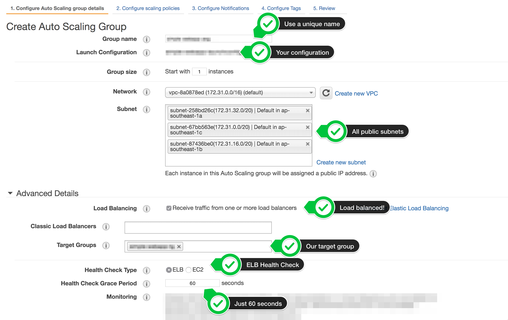
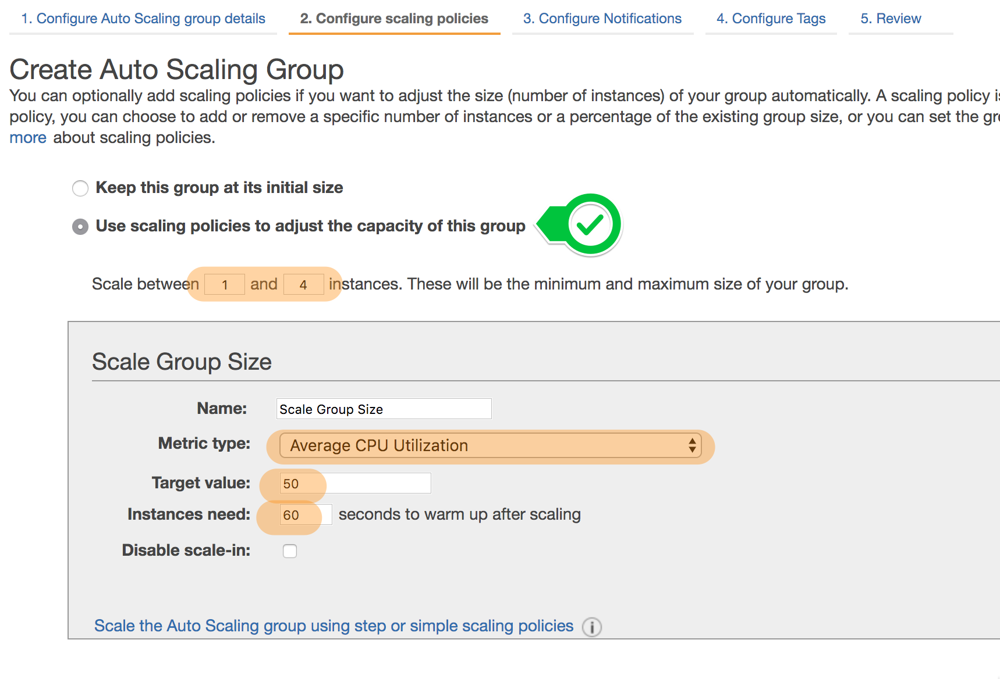
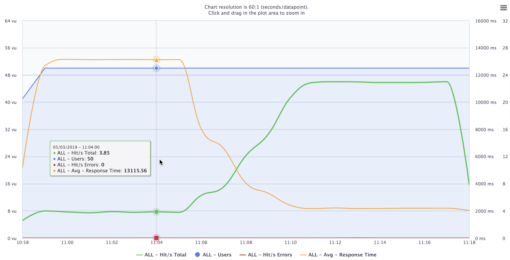
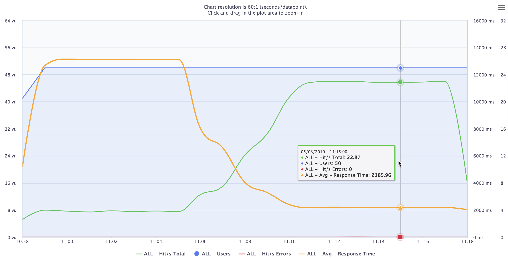

Module 3: Improve scalability with auto-scaling
===

In this module, we'll look into improving our load-balanced architecture by introducing auto-scaling.
Auto-scaling allows your architecture to automatically adapt to real-time changing demand.
For example, if your servers are experiencing heavy load, auto-scaling can automatically add
more servers behind your load balancer to help manage load.

This same technology can also be used to automatically refresh / replace instances that have been
determined to be unhealthy, based on rules you provide. For example, if a server becomes unresponsive or 
otherwise completely crashes, auto-scaling can replace that instance with a new one. 

All of this happens without human intervention, so nobody needs to wake up at 3 AM to respond to 
system failures.


## Solution Architecture

We'll be building off the previous module's architecture.
The web application will function in exactly the same way, except that after this module,
our load balancer will serve requests to a dynamic fleet of web servers, completely managed 
by auto-scaling.


Notice that the architecture hasn't really changed since the last module --- we're just 
augmenting our web server fleet with auto-scaling.


## Implementation Overview

Make sure you're using the same application as from the previous module.

### 1. Create an Auto-scaling group.

An auto-scaling group (ASG) automatically manages your fleet of EC2 instances for you.
It follows a set of policies that you set to determine how many instances to add or remove from your fleet,
and when it should do that (for example, it can add 2 instances automatically in response to a spike in network traffic).

ASGs also monitor the health of your instances, so it can automatically replace instances when they become inoperable.

Finally, ASGs can also automatically deploy instances behind a load balancer, by assigning instances
in a specific target group on creation. (Remember from the last module that load balancers distribute
traffic between all instances inside a target group.)

#### High-level Implementation

Create an auto-scaling group using a new launch configuration. The launch configuration should use 
the AMI you created, deployed onto `t3.micro` instances, and have the same user-data startup script
as the previous module. Ensure instances use the security group you created, and have
detailed monitoring enabled.

Configure the auto-scaling group to start with just **1** instance, and have it deploy into all
available public subnets in your VPC.

Opt to have the ASG use your load balancer from the previous module, with a health check grace period
of about 60 seconds.

Have the ASG maintain an average of 50% CPU load across the fleet.

<details>
  <summary><strong>Step-by-step directions (click to expand):</strong></summary>
  <p>
    
1. Navigate to **Auto Scaling Groups** on the left-hand navigation of your EC2 dashboard. Click **Create Auto Scaling group** at the top of the resulting screen.

2. Select **Launch Configuration**, and opt to create a new launch configuration. Click **Next**.

> ASGs can use both Launch Configurations and Launch Templates.
> Templates give more options and fine-grained control over your ASGs provisioning, 
> but we'll use Launch Configurations for this workshop. 
> Launch Configurations, while older, are still full-functioned, and will illustrate ASGs 
> just as well in this workshop.

3. Creating a new Launch Configuration looks like creating a new EC2 instance.
   1. Opt to use your custom AMI.
   2. Use a `t3.micro` instance.
   3. Under **Launch Configuration**, give your configuration a name you'll remember.
   4. Also opt in to Enable CloudWatch detailed monitoring.

> Detailed monitoring, among other things, makes your CloudWatch metrics aggregate **per minute**,
> instead of every 5 minutes by default.

   5. Still in **Launch Configuration**, in Advanced Details, make sure you put in the User data startup script we used in Module 02.
   ```
   #!/bin/bash -xe
   exec > >(tee /var/log/user-data.log|logger -t user-data -s 2>/dev/console) 2>&1
   
   curl https://raw.githubusercontent.com/creationix/nvm/master/install.sh | sh
   source /.nvm/nvm.sh
   
   nvm install 8.10
   nvm use 8.10
   npm install -g forever
   
   git clone https://github.com/team-siklab/workshop-simple-webapp.git app
   cd app
   git checkout module-02
   
   npm install
   forever start app.js
   ```

4. When prompted for the security group to use, make sure you select the SG you created for your fleet.

5. After confirming the Launch Configuration details, click **Create launch configuration**.
   This will create the configuration, and you should be brought back into the ASG creation screen.

6. Back in the **Create Auto Scaling Group** wizard, give your ASG a name you'll remember.
   1. Opt to start the ASG with just **1** instance.
   2. Make sure you're deploying into the VPC Network you've used for this workshop, and select all 3 public subnets available in that network.
   3. Under **Advanced Details**, opt to receive traffic from load balancers, then select the target group you created in the previous module. 
   4. Still under **Advanced Details**, switch the Health Check Type to `ELB`, and the grace period to only around `60` seconds.

   

7. In the next screen, opt to **Use scaling policies to adjust the capacity of this group**. This will let you use rules to dynamically control the number of instances within the ASG. Let's go with these:
   1. Scale between `1` and `4` instances.
   2. Let's leave **Metric Type** to `Average CPU Utilization`.
   3. Target value at `50`.
   4. Instances need `60` seconds to warm up after scaling.

   

8. `Step 3` allows you to configure notifications to let you know when scaling takes place. Let's skip this for now.

9. For tags, add a `Name` tag with a value that you'll remember. You should be able to tell right away that
   this EC2 instance was created by auto-scaling. Make it something only you will think of.

10. When you're satisfied with everything, click **Create Auto Scaling Group** at the last step.
  </p>
</details>

---

### 2. Remove instances that aren't part of the ASG

In a few minutes after creating your ASG (it'll need some time to warm up completely), it will start creating 
new instances to satisfy the policies you gave it. You should see it create a new instance in a while.


1. Open your load balancer URL `/hello` from a browser, and keep refreshing. Confirm that you see at least 3 instances being hit by the load balancer traffic.

2. On your EC2 console, terminate the **2 instances** you created from the past modules. You should be left with only the instances created by your ASG.

3. Confirm that your web site is still viewable through the load balancer URL.

---

### 3. Simulate heavy load

Now that we've set up an auto-scaling group, let's see how our architecture performs under heavy load.
This workshop uses [Blazemeter](https://blazemeter.com) to run load testing. If you have a personal preference, feel free to use that instead. BlazeMeter lets you run up to 10 tests per month for free, with some constraints.

1. If you don't have a BlazeMeter account, create one on their site.

2. Under **Projects**, create one for your tests. 

3. Click **Create Test**, and select **Performance Tests**.

4. At the top of the form, click **Enter URL/API Calls**. Use the URL of your load balancer with `/computation` fragment. This is a **GET** request.

  > e.g. `http://alb-209238178.ap-southeast-1.elb.amazonaws.com/computation`

  > **Note**: The app logic behind the `/computation` fragment is a deliberately computationally-expensive process. If you visit this page on your browser, there will be a subtle slowness in the response as it performs calculations in the server. On its own, it shouldn't be much, but when forced to perform the same calculation in bulk (like in this load test), the compute costs will eventually bring the server inoperable. 

5. Under **Load Configuration**:
   1. Set total users to `50`.
   2. Set duration to the maximum of `20` minutes.
   3. Set ramp up time to `1` minute.

6. When you're satisfied with your settings, click the green **Run Test** button towards the left of the form.


BlazeMeter will take a few minutes to prepare running your tests, then it will bombard your load balancer with HTTP requests for the next 20 minutes, while providing a nice visualization of the performance of your server during the test.

During this time, take note of your instances and how they react:

- Select an EC2 instance, then navigate to the **Monitoring** tab at the bottom. Keep an eye on what happens to your `CPU Utilization` as the test progresses. You can click on the graph to zoom it in.

- You can also do the same with your load balancer.

- If you navigate to your auto-scaling group, you can review the actions your ASG decide to take in the **Activity History** tab, monitor the instances managed by the ASG in the **Instances** tab, and check out CloudWatch graphs on **Monitoring**.


During your load testing, you should see that the CPU utilization of your EC2 instances start spiking towards `100%` CPU utilization as the load test requests ramp up. Eventually you should see new EC2 instances get created by your ASG to help distribute the load.

After the testing completes, your ASG will maintain your fleet size for a while to account for errant traffic, then after seeing that demand has gone down, it will also start removing EC2 instances to save you costs.

Sample results will look like the following:






## Summary

Auto-scaling groups introduce automation into scaling and repairing infrastructure fleets on the AWS cloud.
Because we are able to provision new resources so quickly on the AWS cloud, we don't have to think so much about how much capacity / resources we need in the future like in traditional IT infrastrucutre --- rather, we only want to know how much we need _right now_. We can always adjust to respond rapidly at any time. Auto-scaling groups make that whole process much easier by automating the process completely.

In the next module, let's expand our web application a bit to use other AWS services.


**Next:** [Using S3 to store file uploads](team-siklab/workshop-simple-webapp/tree/module-04)
