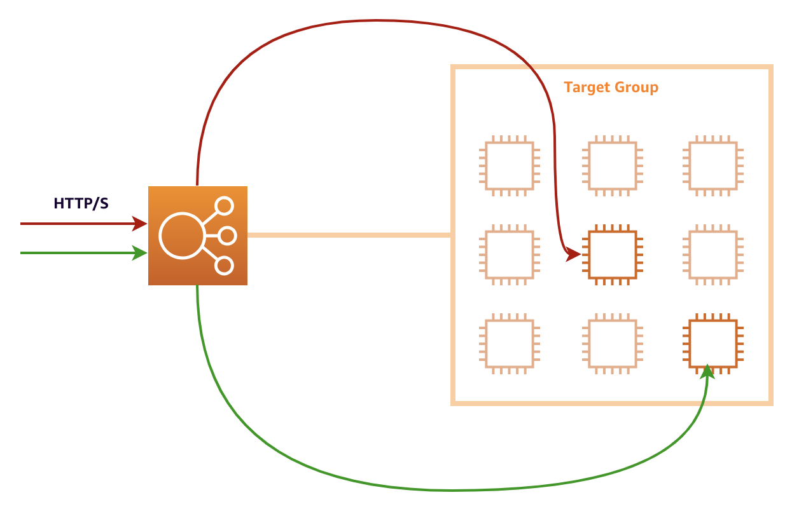

Module 2: Augment your web application with load balancing
===

In this module, we'll talk about how you can use load balancing to scale out applications
across multiple instances. Being able to scale your workloads out is essential in 
running applications that can rapidly adapt to changing real-time demand.


## Solution Architecture

We'll be building off the previous module's architecture.
The web application will function in exactly the same way, except that after this module,
we'll be using multiple instances to run multiple web servers.

A load balancer will be deployed to receive HTTP requests.
It will also be responsible for delegating the requests across all the web servers behind it.


You can extend the same architecture by adding more instances if you'd like.
**By deploying across multiple availability zones**, you can take advantage of the 
[AWS global infrastructure](https://aws.amazon.com/about-aws/global-infrastructure/),
and introduce more durability and resilience to your applications.

## Implementation Overview

Make sure you're using the same application as from the previous module.

### 1. Create an AMI of your web server

Once you've created an EC2 instance and set it up according to your liking, you can
**create an image of it for future use** (called an AMI). This way, when we need to create a copy
of your instance, you won't need to go through all the steps you went through the first time.

#### High-level instructions

Create an AMI of the web server you created in Module 01.

<details>
  <summary><strong>Step-by-step instructions (click to expand):</strong></summary>
  <p>
1. In your EC2 dashboard, make sure the instance you created is selected.

2. Select **Actions > Image > Create Image** from the top menu.

   

3. Give your AMI a unique name you'll easily remember (and optionally a description), and set the same **10GB** of storage as before, then click **Create Image**.

4. The AMI creation process will take a while. You can verify this by going to **AMIs** on the left-hand navigation
   of your EC2 dashboard, and waiting until the status turns to `available`.
  </p>
</details>


### 2. Create a second EC2 instance using your image

If you remember when you created your first EC2 image, you actually had to select an AMI for your first step.
AWS maintains a curated set of barebones AMIs for you to use, but you can also use your own.

In this step, we'll use the AMI you just created to start a copy of your web server.

#### High-level instructions

Create another EC2 instance using your new AMI.
Make sure that the EC2 instance is in a different **public** subnet as your first one.

<details>
  <summary><strong>Step-by-step instructions (click to expand):</strong></summary>
  <p>
    
1. Follow the steps [in Step 1 of Module 01](../tree/module-01#1-create-an-ec2-instance), but do the following:

    1. In `Step 1`: Select **My AMIs** on the left, and select the AMI you just created.
    2. In `Step 3`: Use the same **Network**, but select a different **Subnet** than your first instance. 
      The subnet of your first instance is visible in the Description tab when you select it on the dashboard.
      
      
      
    3. Also in `Step 3`: at the very bottom in **Advanced Settings**, add in the following startup script:
    ```
    #!/bin/bash -xe
    exec > >(tee /var/log/user-data.log|logger -t user-data -s 2>/dev/console) 2>&1
    
    curl https://raw.githubusercontent.com/creationix/nvm/master/install.sh | sh
    source /.nvm/nvm.sh
    
    nvm install 8.10
    nvm use 8.10
    npm install -g forever
    
    git clone https://github.com/team-siklab/workshop-simple-webapp.git app
    cd app
    git checkout module-02
    
    npm install
    forever start app.js
    ```

    4. In `Step 6`: Make sure you use the same security group as the one you created before.
    5. For your keypair: opt to use an existing one, and use the keypair you created before.

2. Once your EC2 instance is ready, confirm that you can visit your web server on it by visiting it's
   **public IPv4 address** at port **3000**.

    ```
    e.g.

    http://52.221.0.100:3000
    ```
  </p>
</details>


### 3. Create an Application Load Balancer (ALB)

We have three different kinds of load balancers in AWS --- ALBs make it easier to segregate 
incoming HTTP/S requests across a fleet of servers behind it.

We'll create an ALB, and add the two instances we currently have behind it to start routing traffic.
We will also use this setup later when we get to automatically healing and scaling our infrastructure.

#### High-level instructions

Create an ALB and a target group, and add the two instances you already have into the target group.
Ensure that the `:80` listener on the ALB redirects to the `:3000` listener on the servers.
Confirm that the ALB is working by visiting its DNS name in a browser.

<details>
  <summary><strong>Step-by-step instructions (click to expand)</strong></summary>
  <p>
1. Select **Load Balancers** from the left-hand navigation of your EC2 dashboard, then click **Create Load Balancer** at the top.
   
2. Select **Application Load Balancer** as the type of load balancer to create.
   Application Load Balancers (ALBs) is a level-7 load balancer that automatically scales to demand, 
   and makes it easy to route HTTP/S requests to your servers.

3. In `Step 1`:

   1. Give your ALB a unique name you'll remember.
   2. Make sure you have a listener for `HTTP` onto port `80` of the load balancer.
   3. Make sure the VPC is your default one, and opt to plce the ALB in all of the availability zones offered.
   4. Leave everything else at the default.

4. Don't mind the warning on `Step 2`.

5. In `Step 3`: select the security group you also use for your instances. Confirm that it allows `HTTP` traffic on port `80` from anywhere.

> **Note**: In real, practical use, you will probably want to use a different security group for your load balancers than the one you
> use for your EC2 instances. This allows you to control the security of your network traffic flow better.
>
> For example, you can allow `HTTP port 80` traffic on your load balancer from anywhere, but only allow `HTTP port 80` traffic 
> from your load balancer to your EC2 instances, preventing anybody from directly accessing your web servers.

6. In `Step 4`: 

  1. Opt to create a **new target group**.
  2. Give your target group a unique name. It's probably a good idea to name it similarly to your ALB.
  3. Keep target type to **Instance**.
  4. Set protocol and port to `HTTP` and `3000`. These is where your web servers are listening in for incoming traffic.
  5. For health checks, select `HTTP`, with the path set to `/hello`.
  6. Under Advanced health check settings, set healthy threshold to `3`, and interval to `10`.

7. In `Step 5`:

   1. Look for your 2 instances from the bottom list, and select them.
   2. Click **Add to Registered**. You should see both instances go up to the upper list.
   3. Click **Next: Review**.

8. Confirm your settings and then click **Create**. Your ALB will take a few minutes to provision and be ready for use.

9. Your ALB will have a DNS name, viewable from the **Description** tab. When your ALB is ready, visit that URL using your browser,
   and confirm that you're hitting one of the 2 servers you've prepared.
  </p>
</details>


## Summary

Application Load Balancers automatically distribute incoming requests to all the **healthy** targets inside the target group attached to it.
The ALB takes care of routing to the instance's private IP addresses (even if they change) so you don't have to.



Unlike physical hardware, ALBs also automatically scale to meet current demand.
If your application is experiencing high volumes of network traffic, ALBs will automatically adjust to be able to address all that.

In this module, you learned how to create an AMI, so you can repeatedly create copies of your instances,
as well as how to create load balancers, so you can start scaling out your applications.

In the next module, we'll make that architecture a bit more intelligent, and use auto-scaling
to make our application adapt automatically to changing demand and usage, as well as be able to
self-repair itself when the needs for it arise.


**Next:** [Improve scalability with auto-scaling](team-siklab/workshop-simple-webapp/tree/module-02)
