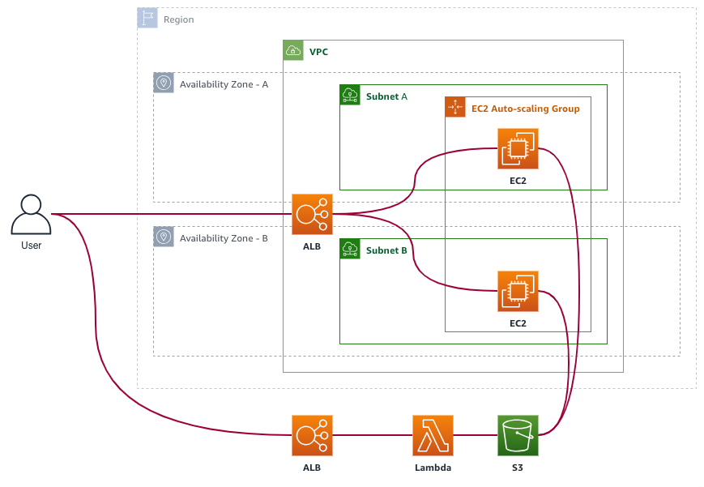

Module 5: Improve security with IAM Roles
===

In the previous module, we gave our web application permissions to upload to S3 by creating a user
it can use to authenticate into the AWS cloud. We used access keys and secrets to allow our server to communicate and function.

While there are very valid use cases for access keys, in the previous module, we really used them in an insecure manner. We hardcoded the keys in plaintext in some of our deployment configurations, and, really, we gave our web application more governing power over our bucket than what it just needed. In the event that our access keys were compromised (and at this point, it's really just a matter of time), the keys can be used to, for example, irrecoverably delete our bucket.

We need to improve on this, and we need to do it as early as possible in the development process.

## Solution Architecture

The architecture for this module is almost exactly the same as the one from last module, 
but we'll improve on some security elements of it.

Namely, we'll use [IAM Roles](https://docs.aws.amazon.com/IAM/latest/UserGuide/id_roles.html) to delegate permissions to our EC2 instances that serve as web servers so that we won't have to manage access keys anymore.

## Implementation Overview

Make sure you're using the same application as from the previous module.

### 1. Delete the IAM user used by your web servers

To start our security improvement efforts, let's delete the IAM user we created from last module.
By deleting this IAM user, we are effectively revoking our application's permissions to use our S3 bucket. We'll reinstate the permissions later using better methods.

#### High-level instructions

Delete the IAM user you created from last module.
Confirm that the image upload on your web application does not work anymore.

  
<strong>Step-by-step instructions (click to expand):</strong>

  

1. Go to your IAM dashboard, and navigate to the **Users** dashboard.

2. Locate the user you created from last module, and select it and click **Delete user**. A confirmation box will appear that warns you about recent access --- confirm that you're sure, and proceed with deletion.

3. Once the user has been deleted, confirm that your web application cannot anymore save to S3 by attempting to upload another image. You should get an error saying that the access key used is unknown. This shows that your web application has lost permissions to interact with your S3 bucket.

  

---

### 2. Update your IAM policy

Last module, you created a policy that gave full access to your S3 bucket. 
Best practice dictates that we follow the **principle of least-privilege** --- meaning we should only give enough permissions as necessary for a process to be able to do what it needs to do, and nothing more.

In our scenario, our web application only needs to be able to upload new images into our S3 bucket --- it doesn't need to do anything else.

We should update our policy to reflect this, and not have it over-provision permissions.

## Summary

Amazon S3 allows you to store virtually unlimited files on virtually unlimited storage in a very
cost-efficient manner, while keeping them highly available and highly durable. Amazon S3 boasts a durability of 99.999999999% (that's 11 nines!). To put that into perspective, if you were to put
10,000,000 files into an S3 bucket, you can expect to lose only one of those files in the next 10,000 years.

An understated advantage of using Amazon S3 is that it takes away load from your web servers.
For example, when you visit the landing page of [Amazon.com](https://amazon.com), the landing page makes 
around ~250 HTTPS requests to serve your page. Of these 250, only 206 are of static files, like images, CSS, and JS files. Those static files account for around **4.15 MB** of the total 4.6 MB of data transfer. If those files were served from Amazon S3, the web servers would get **80%** reduction in request counts, and a **90%** reduction in data throughput. That's very significant.

In this module, we also touched a bit into implementing security and credentials into our web application, however, we honestly did it in a very insecure and dangerous way (like saving our access keys to the server environment variables --- yikes!). In the next module, let's explore ways to improve that.

**Next:** [Improve security with IAM Roles](team-siklab/workshop-simple-webapp/tree/module-04)
