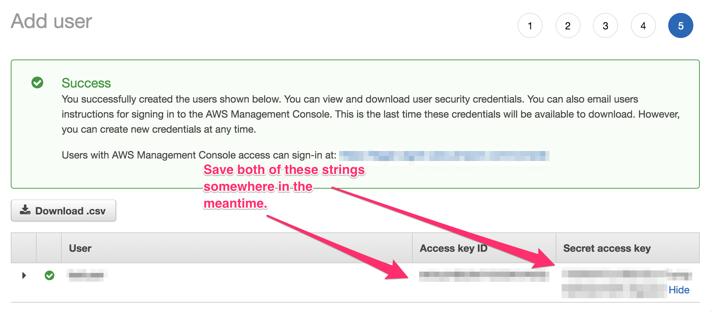

Module 4: Using S3 to store file uploads
===

The AWS cloud is made up of 160+ services, all of which you can put together in interesting ways
to create application workloads of vastly different functionalities. You can think of the AWS cloud
as a collection of lego pieces that you just put together a certain way to get a certain result.

In this module, let's look at integrating [Amazon S3](https://aws.amazon.com/s3) into our application.
Let's assume our web application requires image uploads of some sort --- we could always save uploaded images
in the EC2 instances' disk (this is called [EBS](https://aws.amazon.com/ebs) if you remember), 
but if the EC2 instance goes away for some reason (for example, auto scaling, or if it crashes), you stand
the risk of losing your files. Not to mention that you will potentially have tens, or hundreds, maybe even thousands
of EC2 instances --- wouldn't it be simpler to store files in a central repository?

Amazon S3 is highly-durable, highly-available object storage. You can use it to reliably store
a virtually unlimited number of files for your applications' use. 


## Solution Architecture

We'll introduce an **S3 bucket** into our architecture. All the web servers that we have running in our fleet
will be able to save uploaded files into this S3 bucket.


## Implementation Overview

Make sure you're using the same application as from the previous module.

### 1. Create an S3 bucket

In Amazon S3, a bucket is a logical container for your objects. 
You can create as many buckets as you want, and put in as many files as you want inside each.

When you create a bucket, you decide which AWS region it gets created in --- but take note that
the bucket name **has to be unique globally**, across all AWS accounts. This means that you won't be able
to create a bucket called `testbucket`, because somebody would probably have created that in the past.

#### High-level instructions

Create an S3 bucket. For the purposes of this workshop, specify that this bucket is available for public access.

> **Important**: To facilitate this workshop much more easily, we are **deliberately** making your S3 bucket publicly available.
> In a real-life use-case, chances are you **shouldn't** make your bucket publicly available, and if you _have_ to make them publicly available,
> there are generally better ways to do that rather than specifying that the entire bucket is plainly public.

<details>
  <summary><strong>Step-by-step instructions (click to expand):</strong></summary>
  <p>
1. Navigate to your S3 dashboard through the console.

2. Create a bucket, and give it a name you'll easily remember and recognize. Note that it has to be unique across all buckets globally.

3. Leave all the settings in `Step 2` at their default values, but spend the time to take a look at what you can potentially configure.

4. In `Step 3`, uncheck the 4 options for disabling public access to your bucket. **Read the warning above about this!**

5. Once you're reviewed your configuration, finalize creating your bucket.
  </p>
</details>


### 2. Create security credentials to upload to your bucket

Not just anyone can write into your bucket, and that includes your web application.
To be able to put stuff in, your web application will need to identify itself to AWS, and be granted permission to write into your bucket.
In AWS, we do this using [AWS Identity and Access Management (IAM)](https://aws.amazon.com/iam).

We'll talk more about IAM and security in the next discussion topic.

#### High-level instructions

Create a new IAM user with programmatic access to your account.
Give it full access privileges to your S3 bucket, and take note of the access keys provided.

<details>
  <summary><strong>Step-by-step instructions (click to expand):</strong></summary>
  <p>
1. Navigate to your IAM dashboard through the console. Go to the **Users** section from the left-hand navigation.

2. Click **Add User** at the top. Give your user a unique, memorable name, and select **Programmatic access** at the bottom. Click **Next**.

3. The next screen allows you to select permissions for your user --- what they can and cannot do on what resources.
   1. Select **Attach existing policies directly**, then select **Create policy**.
   2. Use the **Visual Editor** in the next screen.
   3. Select `S3` for **Service**.
   4. Select `All S3 actions` for **Actions**.
   5. Click **Resources**, then choose `Add ARN` for **bucket**. Put in your bucket name, then click **Add**.
   6. Select `Any` for **object**.
   7. Click **Review policy**. Give your policy a name and description, then if you're OK with it, click **Create Policy**.

4. You should be back in the **Add user** screen. Find the policy you just created, and add it to the user you're creating.

5. Go through steps 3 and 4, then click **Create user** once you're satisfied.

6. If you've configured the user correctly, you should see a screen which displays the user's **Access key ID** and **Secret access key**. Copy both, and put them somewhere for now. **Make sure you don't let anybody else see them!**.


  </p>
</details>


### 3. Update your servers configuration to use your IAM user

Your web application is already configured to upload to an S3 bucket, but you will need to configure it with the credentials required to do so.
The source code of the app is looking for the following environment variables:

- `AWS_ACCESS_KEY` --- this is your IAM user's **Access key ID**
- `AWS_SECRET_ACCESS_KEY` --- this is your IAM user's **Secret access key**
- `AWS_UPLOAD_BUCKET_NAME` --- this is your S3 bucket name

If you're interested to see how they're being used, look at `/src/config.js` and `/src/utils/upload.js` in this codebase.

We will need to update our auto-scaling launch configuration to take these variables into account.

<details>
  <summary><strong>Step-by-step instructions (click to expand):</strong></summary>
  <p>
1. Go to **Launch Configurations** on the left hand navigation of your **EC2 dashboard**.

2. Select your configuration from earlier, then click **Actions**, then **Copy launch configuration**.

3. In the resulting pane, go back to **Step 3**.
   1. (Optional) You might want to change the name to something more meaningful.
   2. In **User data** under Advanced Details, update it to the following. Make sure you change the appropriate values for the 3 `export` statements.
```
#!/bin/bash -xe
exec > >(tee /var/log/user-data.log|logger -t user-data -s 2>/dev/console) 2>&1

export AWS_ACCESS_KEY=<your access key>
export AWS_SECRET_ACCESS_KEY=<your secret access key>
export AWS_UPLOAD_BUCKET_NAME=<your S3 bucket name>

curl https://raw.githubusercontent.com/creationix/nvm/master/install.sh | sh
source /.nvm/nvm.sh

nvm install 8.10
nvm use 8.10
npm install -g forever

git clone https://github.com/team-siklab/workshop-simple-webapp.git app
cd app
git checkout module-02

npm install
forever start app.js
```

4. Click **Skip to review**, then click **Create launch configuration** if you're satisfied.

5. Navigate to **Auto Scaling Groups**, then select your ASG. Click **Actions**, then **Edit**.

6. Update the value of **Launch Configuration** to use your update configuration. Then click **Save**.

7. Go to your EC2 **Instances**, and terminate all the instances belonging to your ASG. It might be easier to look at the **Instances** tab on your ASG, and terminate them one by one.

8. Since you just rendered your web application offline, your ASG will automatically try to heal itself by creating new instances. This time, it will use your new launch configuration.
  </p>
</details>


## Summary

Auto-scaling groups introduce automation into scaling and repairing infrastructure fleets on the AWS cloud.
Because we are able to provision new resources so quickly on the AWS cloud, we don't have to think so much about how much capacity / resources we need in the future like in traditional IT infrastrucutre --- rather, we only want to know how much we need _right now_. We can always adjust to respond rapidly at any time. Auto-scaling groups make that whole process much easier by automating the process completely.

In the next module, let's expand our web application a bit to use other AWS services.


**Next:** [Using S3 to store file uploads](team-siklab/workshop-simple-webapp/tree/module-04)
